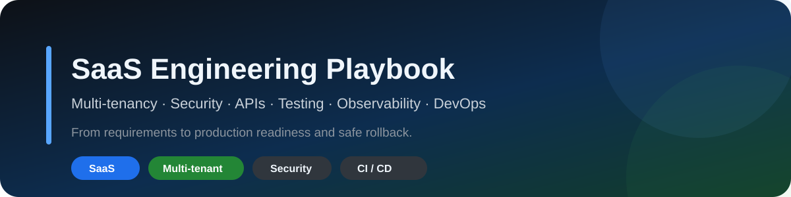
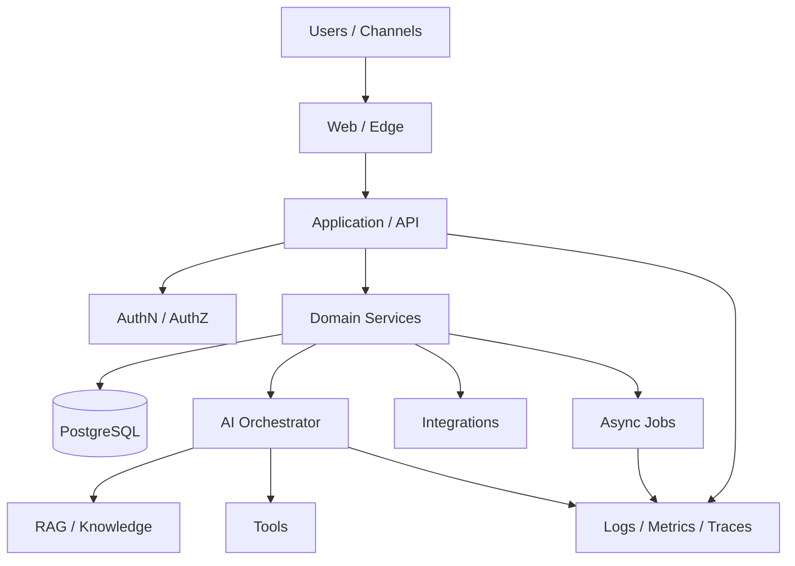

<p align="center"></p>

# Manual de Engenharia de SaaS

**Playbook + projeto executável para projetar, construir, testar e operar SaaS com qualidade de engenharia.**

| Status | Projeto executável | Qualidade |
|---|---|---|
| `v0.2` | **SaaS Tenant Dashboard** | GitHub Actions · typecheck · production build · secret scan |

`multi-tenancy` · `architecture` · `security` · `APIs` · `testing` · `observability` · `DevOps` · `AI Agents`

## Clone & Build no VS Code

O repositório agora inclui um starter Next.js real que pode ser clonado, aberto e modificado localmente:

```bash
git clone https://github.com/Videirafo/SaaS-Engineering-Playbook.git
cd SaaS-Engineering-Playbook/examples/saas-tenant-dashboard
code .
npm install
npm run dev
```

**[Abrir o SaaS Tenant Dashboard →](./examples/saas-tenant-dashboard/README.md)**

No VS Code, use **Run and Debug** para `SaaS: run Next.js` ou **Tasks: Run Task** para:

- `SaaS: dev server`;
- `SaaS: typecheck`;
- `SaaS: production build`.

### O que o exemplo demonstra

- App Router com Next.js 16.3.3 + React 19.2.8 + TypeScript;
- rota dinâmica por tenant;
- resolução do contexto no servidor;
- `/api/health`;
- UI responsiva sem dependência de banco ou API key;
- base explícita para evoluir autenticação, PostgreSQL, `tenant_id`, RLS e audit log.

> O slug da URL **não é isolamento multi-tenant**. O playbook trata autorização e isolamento como controles de servidor e dados, não como convenção visual.

## Por que este projeto existe

Construir um SaaS sustentável exige mais do que telas e banco. O sistema precisa tratar **isolamento de tenants, autenticação, autorização, contratos, migrations, segurança, testes, observabilidade, deploy e rollback**.

```text
PROBLEM
→ REQUIREMENTS
→ ARCHITECTURE
→ DATA & TENANCY
→ SECURITY
→ APIs
→ BUILD
→ TEST
→ SHIP
→ OBSERVE
→ IMPROVE
```

## Conteúdo técnico

- **[Playbook principal](./docs/PLAYBOOK.md)** — ciclo completo de engenharia;
- **[Arquitetura multi-tenant](./docs/MULTITENANCY.md)** — tenancy, isolamento e testes;
- **[AI Agents em SaaS](./docs/AI_AGENTS.md)** — tools, RAG, guardrails e handoff;
- **[Roadmap](./docs/ROADMAP.md)** — evolução planejada;
- **[Projetos executáveis](./examples/README.md)** — exemplos prontos para clone/VS Code.

### Templates

- [Architecture Decision Record](./templates/ADR_TEMPLATE.md)
- [Production Readiness Checklist](./templates/PRODUCTION_READINESS_CHECKLIST.md)
- [Tenant Isolation Test Matrix](./templates/TENANT_ISOLATION_TEST_MATRIX.md)

## Arquitetura de referência



## Quality gate

Antes de chamar um fluxo crítico de pronto:

```text
[ ] requisito e regra de negócio claros
[ ] autorização explícita
[ ] tenant isolation testado
[ ] validação de entrada
[ ] happy path + failure path
[ ] logs e observabilidade
[ ] migration/deploy avaliados
[ ] rollback conhecido
[ ] documentação sincronizada
```

## Git workflow

```bash
git checkout -b feat/minha-evolucao
# altere e valide no VS Code
git add .
git commit -m "feat: minha evolucao"
git push -u origin feat/minha-evolucao
```

Depois abra uma Pull Request. Consulte [CONTRIBUTING.md](./CONTRIBUTING.md).

## Segurança e privacidade

Este repositório contém somente material público. Não publique senhas, tokens, `.env` reais, chaves privadas, IPs internos, dados de clientes, dumps de banco ou código proprietário. Veja [SECURITY.md](./SECURITY.md).

---

Criado por **Fernando Videira** · [Perfil](https://github.com/Videirafo) · [Engineering Portfolio](https://github.com/Videirafo/Fernando_Videira)
