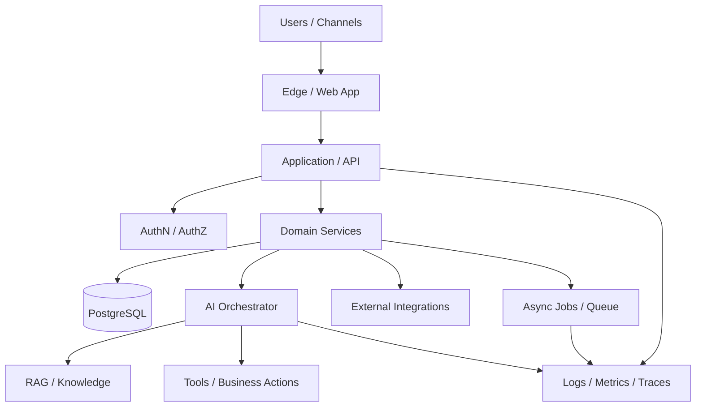

<p align="center"></p>

# Manual de Engenharia de SaaS

**Guia prático para projetar, construir, testar, publicar e operar produtos SaaS com qualidade de engenharia.**

| Status | Foco | Qualidade |
|---|---|---|
| `v0.1 · foundation` | multi-tenancy, arquitetura, segurança e produção | GitHub Actions · docs quality · secret scan |

`multi-tenancy` · `architecture` · `security` · `APIs` · `testing` · `observability` · `DevOps` · `AI Agents`

---

## Por que este projeto existe

Construir um SaaS não é apenas criar telas e conectar um banco de dados. Um produto sustentável precisa tratar desde cedo de **isolamento de tenants, autenticação, autorização, contratos de API, migrations, segurança, testes, observabilidade, deploy e rollback**.

Este playbook organiza essas decisões em um fluxo reutilizável:

```text
PROBLEM
→ REQUIREMENTS
→ ARCHITECTURE
→ DATA & TENANCY
→ SECURITY
→ APIs
→ BUILD
→ TEST
→ SHIP
→ OBSERVE
→ IMPROVE
```

## Para quem é

- desenvolvedores full stack;
- equipes construindo SaaS B2B/B2C;
- estudantes de engenharia de software;
- pessoas criando produtos multi-tenant;
- equipes integrando IA e automações a sistemas de negócio;
- quem precisa levar um MVP até produção sem perder rastreabilidade.

## O que você encontra aqui

| Área | Pergunta que o playbook ajuda a responder |
|---|---|
| Produto & requisitos | O que realmente precisa ser construído e por quê? |
| Multi-tenancy | Como impedir vazamento de dados entre clientes? |
| Auth & autorização | Quem pode fazer o quê em qual tenant? |
| Dados | Como modelar, migrar e preservar integridade? |
| APIs | Como criar contratos evolutivos e previsíveis? |
| Testes | Quais comportamentos precisam ser protegidos? |
| Segurança | Quais controles entram antes da produção? |
| Observabilidade | Como saber quando algo está degradando? |
| Deploy | Como publicar e voltar com segurança? |
| AI Agents | Como integrar IA sem entregar controle irrestrito ao modelo? |

## Mapa do playbook

- **[Playbook principal](./docs/PLAYBOOK.md)** — arquitetura e decisões do ciclo completo.
- **[Arquitetura multi-tenant](./docs/MULTITENANCY.md)** — modelos de tenancy, isolamento e testes.
- **[AI Agents em SaaS](./docs/AI_AGENTS.md)** — tools, RAG, guardrails, handoff e observabilidade.
- **[Roadmap](./docs/ROADMAP.md)** — evolução planejada.

### Templates

- **[Architecture Decision Record](./templates/ADR_TEMPLATE.md)**
- **[Production Readiness Checklist](./templates/PRODUCTION_READINESS_CHECKLIST.md)**
- **[Tenant Isolation Test Matrix](./templates/TENANT_ISOLATION_TEST_MATRIX.md)**

## Arquitetura de referência



A tecnologia pode variar. O princípio permanece: **separar responsabilidades, tornar permissões explícitas e deixar operações críticas observáveis**.

## Quality gates

Antes de considerar um fluxo crítico pronto:

```text
[ ] requisitos claros
[ ] regra de negócio identificada
[ ] autorização explícita
[ ] isolamento de tenant testado
[ ] validação de entrada
[ ] happy path testado
[ ] failure path testado
[ ] logs úteis
[ ] métricas/alertas quando necessário
[ ] migration/deploy avaliados
[ ] rollback conhecido
[ ] documentação sincronizada
```

## Segurança e privacidade

Este repositório contém **somente conhecimento genérico e público**. Não devem ser publicados:

- senhas ou tokens;
- `.env` reais;
- chaves privadas;
- IPs ou endpoints internos sensíveis;
- dados de clientes;
- dumps de bancos;
- código proprietário de projetos privados.

Veja **[SECURITY.md](./SECURITY.md)**.

## Contribuindo

Contribuições úteis são bem-vindas: correções técnicas, exemplos, documentação, testes conceituais e melhorias nos templates.

```text
Issue → branch → mudança pequena → validação → Pull Request → review → merge
```

Veja **[CONTRIBUTING.md](./CONTRIBUTING.md)**.

## Status

**v0.1 — fundação pública.** O projeto está sendo evoluído por conteúdo verificável, exemplos e contribuições reais. Não são criados commits ou PRs artificiais apenas para inflar atividade.

## Sobre o autor

Criado por **Fernando Videira** como parte de uma base pública de engenharia de software.

- [Perfil GitHub](https://github.com/Videirafo)
- [Portfólio técnico e skills](https://github.com/Videirafo/Fernando_Videira)

> A escolha de licença ainda será feita conscientemente antes de declarar direitos de reutilização do conteúdo e dos templates.
