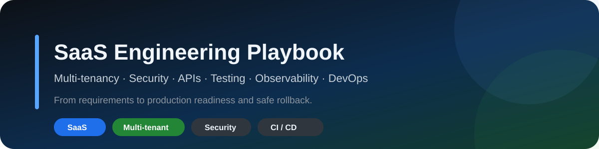
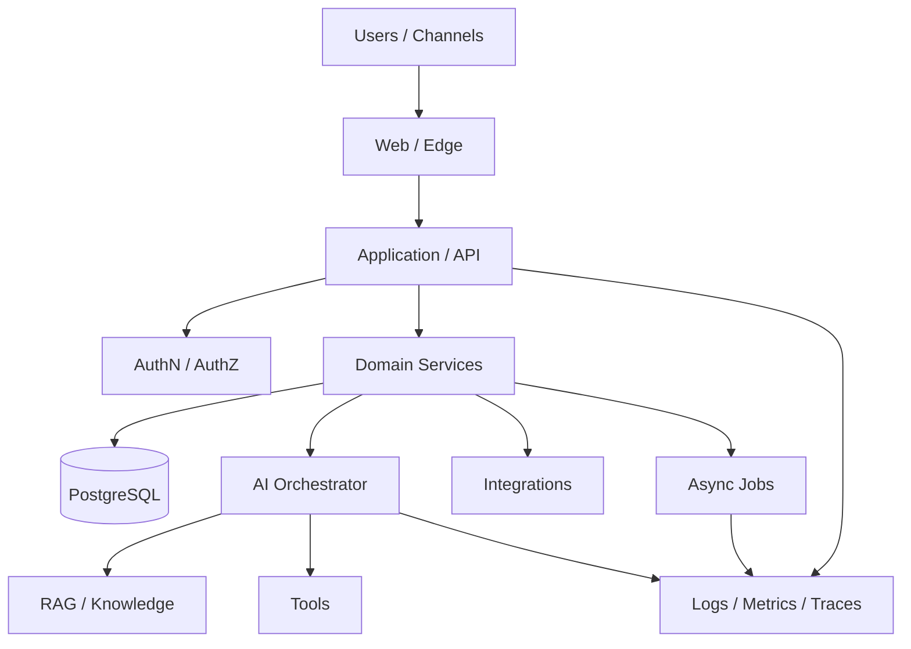

<p align="center"></p>

# SaaS Engineering Playbook

<p align="center">
  <a href="https://github.com/Videirafo/SaaS-Engineering-Playbook/actions"></a>
  <a href="./LICENSE"></a>
  
</p>

**Playbook + projeto executável para projetar, construir, testar e operar SaaS multi-tenant com qualidade de engenharia.**

| Status | Projeto executável | Qualidade |
|---|---|---|
| `v0.3` | **SaaS Tenant Dashboard** | GitHub Actions · typecheck · production build · CodeQL · Docker |

`multi-tenancy` · `architecture` · `security` · `APIs` · `testing` · `observability` · `DevOps` · `AI Agents`

## Comece em 60 segundos

### Docker

```bash
git clone https://github.com/Videirafo/SaaS-Engineering-Playbook.git
cd SaaS-Engineering-Playbook/examples/saas-tenant-dashboard
docker compose up --build
```

Abra `http://localhost:3000` e valide `http://localhost:3000/api/health`.

### VS Code / Node.js

```bash
git clone https://github.com/Videirafo/SaaS-Engineering-Playbook.git
cd SaaS-Engineering-Playbook/examples/saas-tenant-dashboard
code .
npm install
npm run check
npm run dev
```

No VS Code, use **Run and Debug** para `SaaS: run Next.js` ou as tasks de dev, typecheck e production build.

**[Abrir o SaaS Tenant Dashboard →](./examples/saas-tenant-dashboard/README.md)**

## Ajude sem escrever código

Queremos validar o starter com pessoas que não participaram da construção. Clone, execute o dashboard e relate onde o setup ficou lento, confuso ou desnecessário.

**[Testar o quickstart e enviar feedback →](https://github.com/Videirafo/SaaS-Engineering-Playbook/issues/20)**

Para uma primeira contribuição de código, há uma tarefa pequena para transformar o limite entre routing context e autorização em contrato testável.

**[Good first issue: tenant-context contract tests →](https://github.com/Videirafo/SaaS-Engineering-Playbook/issues/19)**

## O que o exemplo demonstra

- Next.js 16.3.3 + React 19.2.8 + TypeScript;
- App Router e rota dinâmica por tenant;
- resolução de contexto no servidor;
- `/api/health` para readiness básica;
- UI responsiva sem depender de banco ou API key;
- base explícita para evoluir autenticação, PostgreSQL, `tenant_id`, RLS e audit log;
- build reproduzível em Docker.

> O slug da URL **não é isolamento multi-tenant**. Autorização e isolamento precisam ser controles reais no servidor e na camada de dados.

## Por que este projeto existe

Construir um SaaS sustentável exige mais do que telas e banco. O sistema precisa tratar **isolamento de tenants, autenticação, autorização, contratos, migrations, segurança, testes, observabilidade, deploy e rollback**.

```text
PROBLEM
→ REQUIREMENTS
→ ARCHITECTURE
→ DATA & TENANCY
→ SECURITY
→ APIs
→ BUILD
→ TEST
→ SHIP
→ OBSERVE
→ IMPROVE
```

## Arquitetura de referência


```mermaid
flowchart TB
    U[Users / Channels] --> E[Web / Edge]
    E --> A[Application / API]
    A --> AUTH[AuthN / AuthZ]
    A --> D[Domain Services]
    D --> DB[(PostgreSQL)]
    D --> Q[Async Jobs]
    D --> I[Integrations]
    D --> AI[AI Orchestrator]
    AI --> R[RAG / Knowledge]
    AI --> T[Tools]
    A --> O[Logs / Metrics / Traces]
    Q --> O
    AI --> O
```

## Conteúdo técnico

- **[Playbook principal](./docs/PLAYBOOK.md)** — ciclo completo de engenharia;
- **[Arquitetura multi-tenant](./docs/MULTITENANCY.md)** — tenancy, isolamento e testes;
- **[AI Agents em SaaS](./docs/AI_AGENTS.md)** — tools, RAG, guardrails e handoff;
- **[Roadmap](./docs/ROADMAP.md)** — evolução planejada;
- **[Projetos executáveis](./examples/README.md)** — exemplos prontos para clone/VS Code.

### Templates

- [Architecture Decision Record](./templates/ADR_TEMPLATE.md)
- [Production Readiness Checklist](./templates/PRODUCTION_READINESS_CHECKLIST.md)
- [Tenant Isolation Test Matrix](./templates/TENANT_ISOLATION_TEST_MATRIX.md)

## Quality gate

Antes de chamar um fluxo crítico de pronto:

```text
[ ] requisito e regra de negócio claros
[ ] autorização explícita
[ ] tenant isolation testado
[ ] validação de entrada
[ ] happy path + failure path
[ ] logs e observabilidade
[ ] migration/deploy avaliados
[ ] rollback conhecido
[ ] documentação sincronizada
```

## Contribua

Issues, testes, exemplos de tenant isolation, ADRs e melhorias no starter são bem-vindos. Leia [CONTRIBUTING.md](./CONTRIBUTING.md) antes de abrir um PR.

Se este projeto for útil:

- dê uma **Star** para ajudar na descoberta;
- use **Watch → Releases** para acompanhar versões importantes;
- abra uma Issue com um cenário real de SaaS que você gostaria de ver modelado.

## Segurança e privacidade

Este repositório contém somente material público. Não publique senhas, tokens, `.env` reais, chaves privadas, IPs internos, dados de clientes, dumps de banco ou código proprietário. Veja [SECURITY.md](./SECURITY.md).

## Licença

Distribuído sob a [MIT License](./LICENSE).

---

Criado por **Fernando Videira** · [Perfil](https://github.com/Videirafo) · [Engineering Portfolio](https://github.com/Videirafo/Fernando_Videira)
